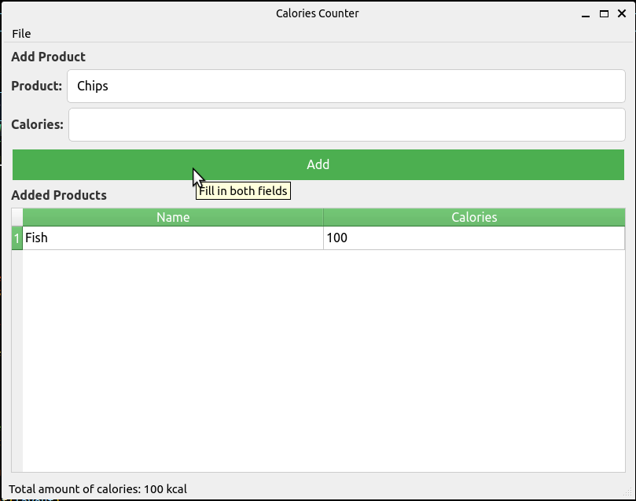

# Calories calculator

This is simple app made on Python and its library pyqt5. 


## How it works

It was created to track calories you are consuming. Everything you need to do is to input name of product and amount of consumed calories in appropriate fields. Then pres putton "add" and product with its amount of calories will be displayed in the table below. Total number of consumed calories is displayed on the status bar below the table.



## Features

In this projects you will found following features:

1. Working with files. Saving user data in a file with subsequient reading it to save information even after app was closed

2. Realisation of pictures within QIcons widget

3. Data input control

4. Event listeners

5. Conditional state of widgets depending of user input (in this app were used about 7 widgets)

6. Styling which loads from a different file. (assets/styles/style.qss)

All necessary assets you will found in assets folder. 

## Project Setup

To make it work you will have to install Pyqt5 on your local machine. To do so use the following command in terminal

```
pip install PyQt5
```
